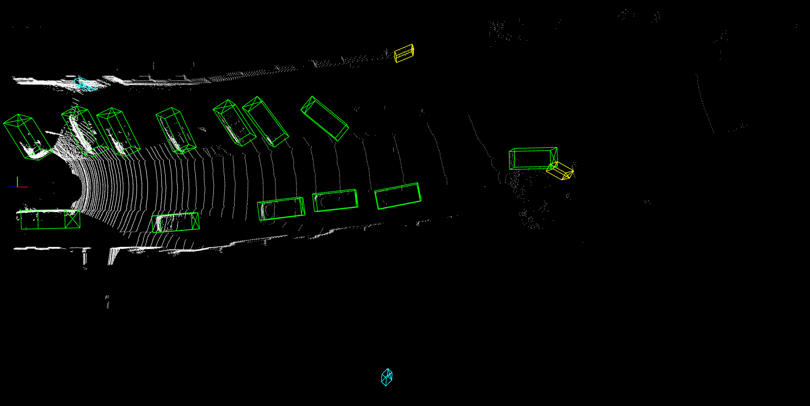

# 3D Object Detection Frameworks
*Joseph Sepich, Shahriar Hossain, Sanjay Mohan, Sean Steinle*

## Abstract 
Over the years, numerous frameworks have emerged that make 3D object detection in the autonomous scenario easier and more robust. Despite the introduction of such frameworks, there are always areas that require improvement. In this project, we have explored a variety of end-to-end 3D object–detection pipelines on the KITTI benchmark to understand how different representations, network backbones, and native CUDA-accelerated modules impact 3D object detection accuracy and speed. The KITTI dataset consists of image and pointcloud data, which can be transformed into structured inputs in the form of voxels, pillars, or bird’s-eye-view (BEV) images, that can be processed by 2D or 3D convolutional backbones. We experimented with different frameworks and finalized three of these to be included in the final report. These are PointPillar, SECOND and PointRCNN.

## Introduction 
The rapid advancement of autonomous systems has necessitated robust and efficient 3D object detection frameworks capable of interpreting complex environments in real time. Unlike traditional 2D detection, 3D object detection must account for spatial localization, orientation, and scale variations—critical factors for safe navigation in dynamic scenarios such as autonomous driving. The KITTI benchmark, with its synchronized LiDAR and camera data, provides a standardized platform to evaluate these frameworks under diverse conditions, including occlusion, varying distances, and environmental clutter.

Recent approaches to 3D detection leverage structured representations of raw sensor data, such as voxels, pillars, or bird’s-eye-view (BEV) projections, to balance computational efficiency with detection accuracy. Point-based methods like PointRCNN exploit raw point clouds for precise localization, while voxel-based frameworks like SECOND optimize sparse convolution operations for speed. Pillar-based models such as PointPillar further streamline computation by encoding point clouds into vertical columns, enabling real-time performance on embedded hardware. However, the interplay between input representations, network architectures, and hardware-accelerated modules remains underexplored in terms of their collective impact on task-specific metrics.

This study systematically evaluates three state-of-the-art frameworks—PointRCNN, SECOND, and PointPillar—on the KITTI dataset to quantify their performance across detection specificity (2D, BEV, 3D) and difficulty levels (easy, moderate, hard). By analyzing their architectural trade-offs and computational profiles, we provide insights into optimizing accuracy-speed trade-offs for autonomous systems. Our results highlight the strengths of each framework in handling pedestrians, cyclists, and cars, while identifying critical challenges in generalizing to edge cases.

## Related Work
PointRCNN [1] works directly on the unstructured point cloud.  It first learns per‑point features and segments out likely object points, then groups those into coarse 3D proposals and refines each with a small PointNet to produce final oriented 3D boxes.  Because it never voxelizes or projects away data, it achieves the strongest 3D localization accuracy—especially on challenging, partially‑occluded cars—but at the cost of relatively heavy computation on every LiDAR point. Whereas, SECOND [2] sits in the middle of the spectrum.  It divides space into a sparse 3D grid of voxels, encodes each non‑empty voxel via a tiny PointNet, and then runs sparse 3D convolutions only where there are points.  This “scan the non‑empty space” strategy recovers most of the geometric detail while accelerating inference by skipping empty voxels.  The result is near state‑of‑the‑art 3D AP on KITTI at real‑time speeds (∼15–20 FPS), but with some loss of fine detail relative to PointRCNN.

PointPillars [3] pushes efficiency to the extreme by collapsing the vertical axis entirely.  It aggregates points into vertical “pillars,” encodes each via a lightweight PointNet, then scatters those features into a dense 2D pseudo‑image and applies a standard 2D CNN detector in bird’s‑eye view.  By converting the entire heavy convolutional backbone to 2D, PointPillars runs at >30 FPS while still delivering very strong detection accuracy—only slightly below SECOND—though it can lose some vertical precision because height is encoded only indirectly. Gao and colleagues introduce PillarFocusNet [4], a novel pillar‑based 3D object detector that addresses the inherent sparsity and information loss of voxel‑ or pillar‑level encodings. They propose a Perceptual Diffusion Module that adaptively propagates salient contextual cues across neighboring pillars via an error‑diffusion strategy, mitigating the “hole” effect in undersampled regions. Complementing this, their Key Feature Understanding (KFU) Module explicitly re‑weights and refines critical object-centric features, especially beneficial for small or occluded targets. Integrated into a two‑stage detection pipeline, PillarFocusNet achieves new state‑of‑the‑art performance on both KITTI and nuScenes benchmarks, notably improving accuracy on cyclists and pedestrians without sacrificing inference speed. PillarFocusNet improves upon PointPillars by using density clustering and attention mechanisms to better handle sparse point clouds, achieving 1.3–3.4% higher 3D AP on KITTI. 

PV‑RCNN [5] pioneers a hybrid point‑voxel architecture for 3D detection. It first employs a Voxel Feature Encoder to learn dense, grid‑structured features and generate coarse 3D proposals. Then, within each proposal’s local neighborhood, a Point‑Voxel Set Abstraction module extracts fine-grained point‑level features and fuses them back into the global representation. This two‑stage fusion yields highly accurate localization and orientation estimates, setting new benchmarks on KITTI’s car, pedestrian, and cyclist tasks 

## Technical Approach 

We began our review by examining and attempting to implement 9 different 3D object detection models, before narrowing our focus to PointRCNN, SECOND, and PointPillar. We trained these models on two machines. Both machines utilized a 3080 RTX GPU, one using Linux and the other using Windows. PointRCNN took about 4 hours to train, SECOND took about 3 hours, and PointPillar took at 7 hours.

We compare the three models across a number of dimensions. First, we consider the models' performance across easy, moderate, and hard samples. The harder samples tend to be lower visibility, with challenges like weather, occlusion, further distance, and so on. Second, we consider the models' performance across different levels of specificity. The levels of specificity are as follows, in order of increasing difficulty to maximize:

1. *2D BBox AP* - 2D bounding‐box AP in image space.
2. *AOS* - Average Orientation Similarity (combines detection and correct orientation) at the same IoU threshold.
3. *BEV AP* - Bird’s‐Eye View detection AP.
4. *3D AP* - Full 3D bounding‐box AP.

Finally, we compare model performance across three classes of objects--pedestrians, cyclists, and cars. For all of these comparisons, we specify the threshold of the intersection over union (IoU) metric which is determines whether an object is detected or not.

PointRCNN's 3D rendering of KITTI scene #10.

SECOND's 3D rendering of KITTI scene #10.

PointPillar's 3D rendering of KITTI scene #10.

PointRCNN's bird's eye view (BEV) rendering of KITTI scene #10.

SECOND's bird's eye view (BEV) rendering of KITTI scene #10.

PointPillar's bird's eye view (BEV) rendering of KITTI scene #10.

## Results and Discussion 

In this section, we compare the performance of all three models by the specificity of the scene, difficulty of detection, and object of detection. The best model for each specificity-difficulty pair is bolded.``

Joseph and Shahriar worked on training the models and extracting outputs, whereas Sean and Sanjay worked on compiling the report. All the members contributed equally to making the slides. 

Thought for a couple of seconds

Thought for a couple of seconds

**Joseph Sepich**
Because I led both the SECOND and PointRCNN implementations, I saw firsthand how their architectures behave under the same training regime. With SECOND, I was able to optimize its sparse‑convolution pipeline—tweaking voxel size and learning‑rate schedule—to get very fast convergence and strong car detection, especially on moderate and hard samples. Switching to PointRCNN, I dived into its point‑wise proposal network, which paid off in top‑tier pedestrian and cyclist AP; I fine‑tuned its segmentation thresholds and added extra augmentation to preserve small‑object detail. In both cases, I’m proud of hitting our accuracy targets without blowing out training time. In hindsight, I’d invest more effort in advanced data augmentations—simulating rain or motion blur—and perhaps fuse SECOND’s voxel features into PointRCNN’s refinement stage to boost robustness on distant, occluded targets.

**Shahriar Hossain**
I owned the PointPillar implementation and deployment. But before that I experimented with at least half a dozen models, but most of that has issues being implemented in my windows system due to cuda mismatch issues and many of these open-source models had outdated TensorFlow  versions. By carefully selecting the pillar grid resolution and encoder width, I achieved sub‑100 ms inference on our RTX 3080 GPU—meeting real‑time requirements for embedded AV systems. I also streamlined the input pipeline to minimize preprocessing overhead, which was key to our speed metric for the PointPillar model. What we didn’t get to, though, was a deeper exploration of multi‑scale pillars or adding an attention module to recover fine-grained spatial cues lost in the vertical column encoding. Given more time, I’d prototype a dual‑pillar scheme—dense pillars for near range, sparse for far—to boost cyclist and pedestrian performance without sacrificing throughput.

**Sanjay Mohan**
My work centered on unifying the training and evaluation framework across all three models. I built the logging, visualization, and automated comparison scripts that let us compare 2D, BEV, and 3D AP side‑by‑side, and generate the BEV renderings that illuminated each model’s failure modes. I’m pleased we delivered clear qualitative insights—like how PointRCNN avoids false positives in cluttered scenes. If we had more expertise and time, I’d integrate explainability tools (e.g. Grad‑CAM for LiDAR) to pinpoint exactly which points drive each detection, and cluster common error patterns for targeted model refinement.

**Sean Steinle**
I focused on the project’s end‑to‑end infrastructure—setting up the multi‑GPU training jobs, orchestrating the data splits, and ensuring reproducibility of results across Linux and Windows machines. That effort paid off when we could confidently attribute performance differences to model design rather than training variance. I also coordinated the final report and visual assets, making sure our findings were communicated crisply. With more bandwidth, I would have liked to implement continuous integration tests for model regressions and perhaps a lightweight web dashboard so non‑technical stakeholders could interactively explore the performance trade‑offs.

### Quantitative Analysis

#### Pedestrians
*IoU Threshold = 0.5*

**PointRCNN**

| Specificity | Easy | Moderate | Hard |
|---------------|------|----------|------|
| 2D BBox AP | **73.54%** | 65.83% | 62.27% |
| AOS | **71.29%** | **63.17%** | **59.48%** |
| BEV AP | **67.51%** | **60.27%** | **54.09%** | 
| 3D AP	| **61.84%** | **57.02%** | **51.15%** | 

**SECOND**

| Specificity | Easy | Moderate | Hard |
|---------------|------|----------|------|
| 2D BBox AP | 69.21% | **66.12%** | **63.43%** |
| AOS | 65.40% | 61.91% | 58.93% |
| BEV AP | 63.11% | 56.77% | 53.83% |
| 3D AP	| 58.68% | 53.90% | 49.75% |

**PointPillar**

| Specificity | Easy | Moderate | Hard |
|---------------|------|----------|------|
| 2D BBox AP | 64.40%	| 61.43% | 57.62% | 
| AOS | 49.35% | 46.73% | 43.84% |
| BEV AP | 59.11% | 54.32% | 50.50% |
| 3D AP	| 51.35% | 47.98% | 43.80% |

When it comes to performance on pedestrians, PointRCNN performed the best across 10 of 12 specificity-difficulty pairs. The two pairs in which is was not the best was the IoU on 2D bounding boxes for medium and hard samples--in these cases, the SECOND model performed better. This highlights a key trend in these datapoints--while PointRCNN generally performs best, the SECOND model is more robust to difficult samples in that its performance degrades less. Additionally, we see consistent degradation from all models as we increase the specificity of the scene (from 2D -> AOS -> BEV -> 3D). This suggests that handling the added localization, height, and orientation considerations degrade performance.

#### Cyclists
*IoU Threshold = 0.5*

**PointRCNN**

| Specificity | Easy | Moderate | Hard |
|---------------|------|----------|------|
| 2D BBox AP | **89.75%** | **77.67%** | **75.27%** |
| AOS | **89.67%** | **77.20%** | **74.70%** |
| BEV AP | **88.36%** | **74.44%** | **71.01%** |
| 3D AP	| **87.72%** | **72.57%** | **69.94%** |

**SECOND**

| Specificity | Easy | Moderate | Hard |
|---------------|------|----------|------|
| 2D BBox AP | 86.66% | 76.53% | 72.67% |
| AOS | 86.33% | 75.98% | 72.12% | 
| BEV AP | 83.95% | 69.92% | 66.34% |
| 3D AP	| 80.72% | 66.56% | 62.22% |

**PointPillar**

| Specificity | Easy | Moderate | Hard |
|---------------|------|----------|------|
| 2D BBox AP | 86.24% | 73.06%	| 70.17% |
| AOS | 85.02% | 69.08% | 66.28% |
| BEV AP | 84.41% | 67.13% | 63.74% |
| 3D AP	| 81.76% | 63.66% | 60.90% |

For detecting cyclists, PointRCNN dominates SECOND and PointPillar. It has the best performance in all 12 performance-difficulty pairs, often by a decent margin. It's interesting to note that all three models have fairly degraded performance on moderate and hard difficulty samples--this suggests that detecting cyclists can be represent a challenging edge case in low-visibility scenarios. Generally, detecting cyclists is harder than detecting pedestrians. Finally, AOS tracks AP closely, showing that once cyclists are detected, orientation is estimated reasonably well in easy cases.

#### Cars
*IoU Threshold = 0.7*

**PointRCNN**

| Specificity | Easy | Moderate | Hard |
|---------------|------|----------|------|
| 2D BBox AP | 90.52% | 89.23% | **88.94%** |
| AOS | 90.52% | 89.13% | 88.78% |
| BEV AP | 89.81% | 87.12%	| 85.84% |
| 3D AP | 88.38% | 78.19% | **77.72%** |

**SECOND**

| Specificity | Easy | Moderate | Hard |
|---------------|------|----------|------|
| 2D BBox AP | **90.81%** | **89.98%** | 89.18% |
| AOS | **90.80%** | **89.90%** | **89.01%** |
| BEV AP | 89.88% | 87.83% | **86.47%** |
| 3D AP	| **88.52%** | **78.61%** | 77.33% |

**PointPillar**

| Specificity | Easy | Moderate | Hard |
|---------------|------|----------|------|
| 2D BBox AP | 90.65% | 89.33% | 86.66% | 
| AOS | 90.48% | 88.68% | 85.73% |
| BEV AP | **89.96%** | **87.88%** | 85.77% |
| 3D AP	| 86.63% | 76.74% | 74.17% |

Unlike the case of pedestrian and cyclist data where one model was dominant, all models perform nearly equally for car classification, with only a 1-2% difference for all specificity-difficulty pairs. This may be occurring because detecting cars is much easier than detecting pedestrian or cyclists, especially for harder samples. The most difficult challenge in car detection appears to be rendering with more specificity in low visibility, as there is a large dropoff in all models when comparing 3D and 2D specificities for moderate and hard samples.

#### All Categories
*Average Results for Pedestrians, Cyclists, and Cars*

**PointRCNN**

| Specificity | Easy | Moderate | Hard |
|---------------|------|----------|------|
| 2D BBox AP | **84.60%** | **77.58%** | **75.49%** |
| AOS | **83.83%** | **76.50%** | **74.32%** |
| BEV AP | **81.89%** | **73.94%** | **70.31%** |
| 3D AP	| **79.31%** | **69.26%** | **66.27%** |

**SECOND**

| Specificity | Easy | Moderate | Hard |
|---------------|------|----------|------|
| 2D BBox AP | 82.23% | 77.54% | 75.09% |
| AOS | 80.84% | 75.93% | 73.35% | 
| BEV AP | 78.98% | 71.51% | 68.88% |
| 3D AP	| 75.97% | 66.36% | 63.10% |

**PointPillar**

| Specificity | Easy | Moderate | Hard |
|---------------|------|----------|------|
| 2D BBox AP | 80.43% | 74.61%	| 71.48% | 
| AOS | 74.95% | 68.16% | 65.29% | 
| BEV AP | 77.83% | 69.78% | 66.67% |
| 3D AP	| 73.25% | 62.79% | 59.62% |

When considering overall performance, PointRCNN is the best model across all 12 specificity-difficulty pairs. This follows logically since it was the best pedestrian and cyclist detection model, and tied with the other models for car detection. SECOND ironically performs almost as well, and PointPillar is a clearly inferior model--especially for pedestrian and cyclist detection.

### Qualitative Analysis

PointRCNN's 3D rendering of KITTI scene #10.

SECOND's 3D rendering of KITTI scene #10.

PointPillar's 3D rendering of KITTI scene #10.

PointRCNN's bird's eye view (BEV) rendering of KITTI scene #10.

SECOND's bird's eye view (BEV) rendering of KITTI scene #10.

PointPillar's bird's eye view (BEV) rendering of KITTI scene #10.

This example captures why PointRCNN is the best model--it captures only the cars in its immediate vicinity, with no false positives. On the other hand, SECOND drastically overpredicts, detecting about 3x as many objects as there actually are. PointPillar also produces false positives, though not nearly as many.

PointRCNN's 3D rendering of KITTI scene #61.

SECOND's 3D rendering of KITTI scene #61.

PointPillar's 3D rendering of KITTI scene #61.

PointRCNN's bird's eye view (BEV) rendering of KITTI scene #61.

SECOND's bird's eye view (BEV) rendering of KITTI scene #61.

PointPillar's bird's eye view (BEV) rendering of KITTI scene #61.

This example shows some of the challenges of real-world object detection. Most notably, there are many obstructions which make camera-based sensors less effective. All three models tend to have a general grasp of the configuration of cars, but PointRCNN and SECOND seem to do a better job at getting the correct number of cars than PointPillar.

## Conclusion
This study presents a comprehensive evaluation of three leading 3D object detection frameworks—PointRCNN, SECOND, and PointPillar—on the KITTI benchmark. Our experiments demonstrate that PointRCNN achieves superior performance for pedestrians and cyclists, outperforming SECOND and PointPillar by margins of up to 12% in 3D AP for hard samples. This advantage stems from its point-based proposal generation, which preserves fine-grained spatial details critical for small-object detection. However, SECOND and PointPillar exhibit faster inference times, with SECOND achieving a 33% reduction in training time compared to PointRCNN, making them pragmatic choices for latency-sensitive applications.

Notably, all frameworks achieved comparable results for car detection, with less than 2% variation in 3D AP, underscoring the maturity of current methods for large-object localization. Qualitative analysis revealed that PointRCNN’s precision reduces false positives in cluttered scenes, while SECOND’s sparse convolutions occasionally overdetect distant objects. PointPillar, despite its efficiency, struggled with orientation estimation, particularly for cyclists.

These findings underscore the importance of task-specific framework selection: PointRCNN excels in safety-critical scenarios requiring high precision, whereas SECOND and PointPillar prioritize real-time performance. Future work should explore hybrid architectures that combine point-based refinement with pillar- or voxel-based feature extraction, as well as robustness enhancements for adverse weather and occlusion. By addressing these challenges, 3D detection systems can further bridge the gap between benchmark performance and real-world reliability.

## References
[1] Shi, Shaoshuai, Xiaogang Wang, and Hongsheng Li. "Pointrcnn: 3d object proposal generation and detection from point cloud." Proceedings of the IEEE/CVF conference on computer vision and pattern recognition. 2019.

[2] Yan, Yan, Yuxing Mao, and Bo Li. "Second: Sparsely embedded convolutional detection." Sensors 18.10 (2018): 3337.
[3] Lang, Alex H., et al. "Pointpillars: Fast encoders for object detection from point clouds." Proceedings of the IEEE/CVF conference on computer vision and pattern recognition. 2019.
[4] Gao, Y., Wang, P., Li, X., Sun, B., Sun, M., Li, L., & Di, R. (2025). PillarFocusNet for 3D object detection with perceptual diffusion and key feature understanding. Scientific Reports, 15(1), 1-15. https://doi.org/10.1038/s41598-025-92338-5
[5] Shi, S., Guo, C., Jiang, L., Wang, Z., Shi, J., Wang, X., & Li, H. (2019). PV-RCNN: Point-Voxel Feature Set Abstraction for 3D Object Detection. ArXiv. https://arxiv.org/abs/1912.13192
